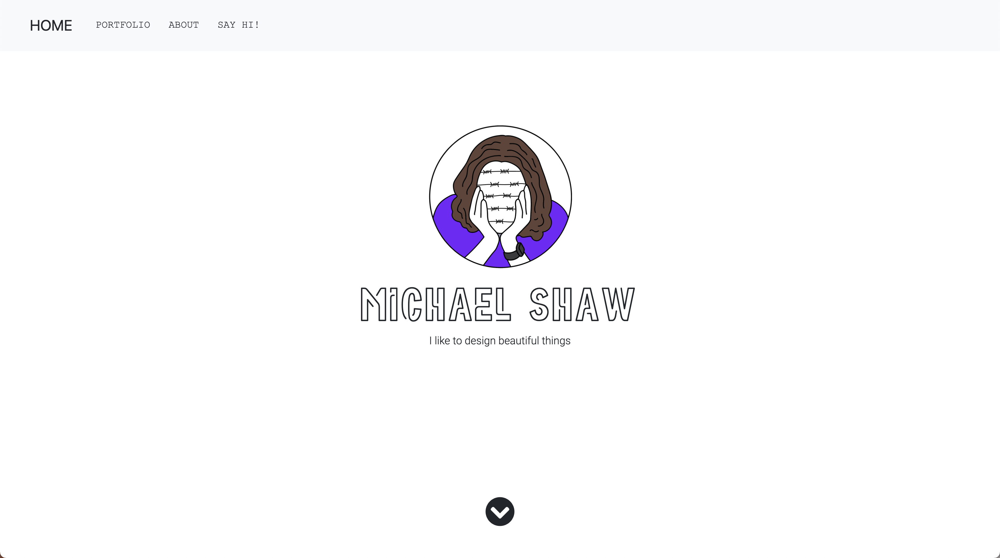

# Professional Portfolio

This is a deployed portfolio for Michael Shaw.

### Getting Started

This project has been deployed to GitHub Pages. To view, you can follow the deployment link. Or, download the source files and open on your local computer.

* [Deployed GitHub IO](https://michaelshxw.github.io/professional-portfolio/)
* [GitHub Repository](https://github.com/michaelshxw/professional-portfolio)

### Prerequisites
To install this application, a text editor such as Visual Studio Code is required. This can be downloaded [here.](https://code.visualstudio.com/download)

### Languages Used
* HTML 
* CSS

### Installation
To install this code, download the zip file, or use GitHub's guidelines to clone the repository

### Authors
* **Michael Shaw** (HTML and CSS) [GitHub Profile](https://github.com/michaelshxw)
